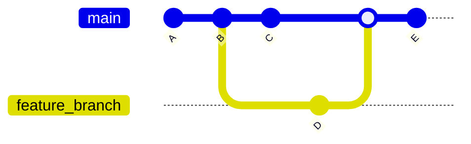
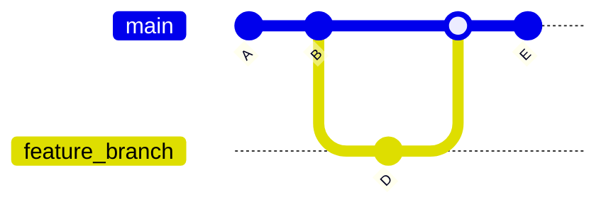
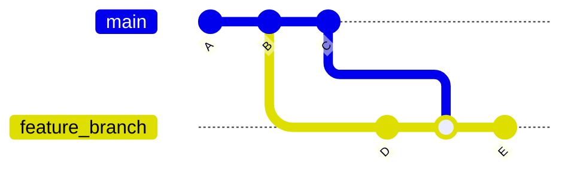
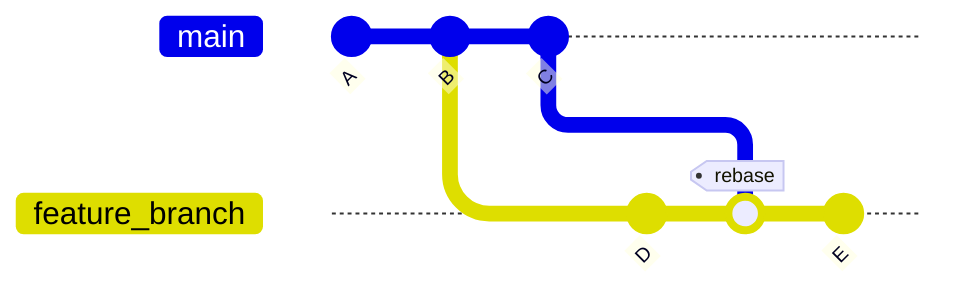
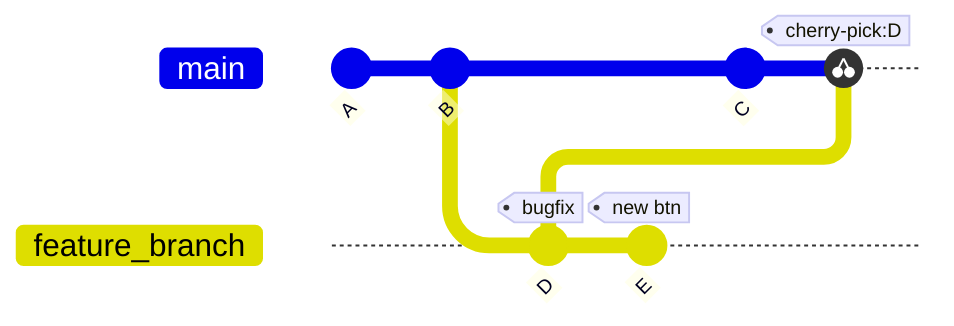

## History

Use `git log --oneline` or `git log branch --oneline` to get git history

## Merge

3-way merge, main branch will be: `A -> B -> C -> D -> F -> E` (with F being "Merged branch feature_branch").
Called 3-way since git uses the difference between commit B (latest common ancestor) and C and B and D to resolve any conflicts between the two branch tips.


Fast-forward merge, main branch will be: `A -> B -> D -> E` (no extra merge commit). Removes the feature_branch since the HEAD of main branch is just placed at commit D. To disable fast-forwarding, use the `--no-ff` flag, which creates a merge commit and keeps the feature_branch separated.


Same 3-way merge as before, but instead of on the tip of the main branch it's on the tip of feature branch. Useful to test if changes on main branch are compatible with new feature.
Doing this multiple times and then merging it back into main branch might make it look messy, but we're always flowing forward in time and not changing history. If you want to prevent this from looking messy, you have to use git rebase (see below).

## Rebase

Suppose you want to have commit C on feature_branch without a merge commit, you can rebase it. Then feature branch looks like: `A -> B -> C -> D' -> E`. Now you can fast forward merge and the main's branch history is linear and looks clean.
However, as you've noticed we put the commit D behind the commit C. Which is possible by "copying" the commit D, and pasting it behind commit C, however, this creates a different commit with a different hash. So the original D is not the same as the new D. This might cause issues when collaborting with multiple people. It's also bad practice to rebase into main branch.
"Do not rebase commits that exists outside your repository and that people may have based work on.".

## Cherry Picking

To only get commit D (the bugfix), but not commit E (new button for new feature) on the main branch we can use cherry picking. Since history is changed just like with history it won't be commit D but actually commit D' (with a different hash).

## Fixing merge conflicts
Run `git status` to see the conflict status, which shows which file(s) causes this conflict.
You can use `git .. --abort` to cancel your merge (with `..` being `merge`, `rebase` or `cherry-pick` or whatever command u ran which caused this conflict).
If you open the file(s), you will see something like this:
```
1
<<<<<<<<<<<< HEAD
2
=======
3
>>>>>>>>>>> d81b1f0 (bugfix)
4
```
Top part (2) shows changes from branch you want to merge into, and bottom part (3) shows changes from the branch you want to merge from. Edit the file like how you want it to be and then run: `git status` and see if it's fixed.
If it's fixed you can run `git .. --continue` to continue with the merge.

You can also use `git stash` to temporarily "undo" changes, then merge, then `git stash apply` to re-do those changes on top of the merge.