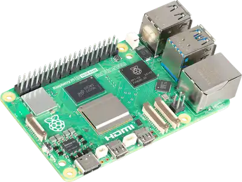
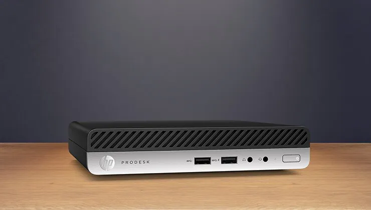

import { FileTree } from '@astrojs/starlight/components';

This is a simple guide to help you setting up your own homelab :)

## Hardware

One of the most important things to decide on is what hardware you want to use to run your homelab on. There are many great options but you will have to decide on that for your own, as each option has it's own pros and cons.

### Virtual Private Server (VPS)

A VPS is simply a "computer" that is running in the cloud (aka, probably in a datacenter from AWS/Azure/Google). You pay them a monthly fee and do not have to worry about electricity costs of hardware maintenance. In addition, it is very easy to allow other people to use your hosted things without exposing your own home network.

### Raspberry pi

A small computer (credit card sized) that includes everything you need. It's a bit on the expensive side but it's very small and can be used for multi purposes (think of hardware projects etc).



### Mini pc

A small computer most often used in corporate settings. It's a small "box" that is not super performant but works well for office works.

It is pretty cheap, does not use a lot of power and (compared to a VPS) is pretty performant for a homelab server.



### Old (enterprise) server

A big (rack mounted) server. If you do not want to sell your kidneys, then you will need to look for old(er) hardware which will draw a lot of power. Especially when you have high electricity prices I can not recommend this, despite their high performance. They also generate a ton of sound because they use tiny (but thick) fans.

If you do not care about/have cheap electricity pricing and can put it in the attic/garage/some place where you don't care about sound, then this is a great option. They come with a ton of performance, however, they might not support all the latest hardware as they can be more than 10 years old.

### Old desktop/laptop

If you have one of those laying around, for sure the best option. They are (probably) more powerful than all options listed above except the enterprise server and are basically for free (or require a minimal amount of upgrades).

### Other

Of course there are also more options such as using your NAS (if you have one and it allows for SSH access) or using your desktop pc/laptop (if you only need the services to be accessible when you are on your pc anyway).

## Operating system

Whilst you can use Windows (server edition) on your homelab devices, I always prefer linux because it uses much less resources, is easier to use and is more fun to setup (well, in my opinion that is). Depending on your needs there are various options:
- TrueNAS / Unraid / HexOS: all-in-one solution for setting up your device as a NAS and more
- Proxmox: for easy creation of virtual machines
- NixOS: use config files to setup your complete OS
- Debian/ubuntu/etc: "basic" option

There are a ton more options and everyone has a different opinion on it. I use debian most of the times (and if you don't know then you probably also want to stick to debian, unless you want one of those features above).

## Software setup

You can of course install different kinds of programs/services similar to how you would install them on your desktop OS. However, this quickly becomes very messy so you probably want to use one of the following:
- VMs (one VM per service)
- Docker (one container per service)
- Kubernetes (one pod per service)

VMs uses more resources as you are hosting an entire operating system per service, docker/kubernetes are very similar and use less resources than VMs. In my opinion docker is easier to use whilst kubernetes is more advanced/gives more flexibility.

I use docker but other people swear by VMs and other prefer kubernetes, but for a simple homelab docker is good enough :)

### Filesystem layout

With docker I usually have the following layout in `/home/username`:

<FileTree>
- docker
  - xxx
    - compose.yml
  - yyy
    - config/
    - compose.yml
- docker_data/
  - xxx
    - database.sqlite
</FileTree>

The `docker` directory contains one folder for each service which contains the compose file for that service. Next to the compose file there might also be configuration files.

Then using rsync I can easily backup (incrementally) my whole setup:
```bash
rsync -a --delete --backup --backup-dir=./backups/$(date +%F)/docker/ device:/home/username/docker/ ./backups/docker/
```

Where it stores modified/deleted files (since last backup) in `backups/yyyy-mm-dd/docker/...` and the current/latest files in `backups/docker/...`

The `docker_data` directory contains one folder for each service that contains database files or other files that I do not want to backup incrementally (such as data that can easily be re-downloaded) but still want to backup nonetheless.

```bash
rsync -a --delete device:/home/username/docker_data/ ./backups/docker_data/
```

Please note that for postgres databases they can not be backed up like that (it **will** cause corruption), but instead you can use `pg_dumpall`:

```bash
ssh device 'docker exec -t service-postgres pg_dumpall -c -U service' > ./backups/service.sql
```

Where `service-postgres` is the name of the postgres container and `service` is for example `keycloak` or `planka` or whatever.